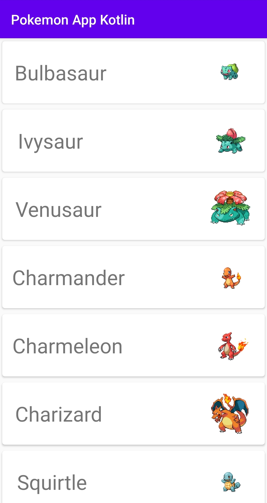
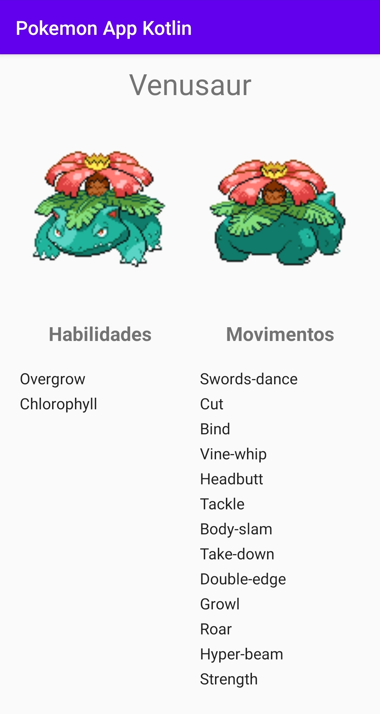

<h1 align="center">
  Pokemon App Kotlin 
</h1>

Pokemon App Kotlin is a project created by Bruno Ponte. This app uses the <a href="https://pokeapi.co/">PokéApi</a> to show a list of all pokemons, including its details and photos.

  

  

  
  

Esta é uma <b>single-activity application que utiliza o componente Navigation</b> para gerir os dois Fragmentos existentes - no primeiro, PokemonListFragment, é possível ver a lista de Pokémons com respetivo nome e foto; no segundo, PokemonDetailsFragment, é possível ver os detalhes de um Pokémon, o que inclui nome, foto frontal e traseira, habilidades, e movimentos.

É utilizado o design pattern <b>MVVM</b>, sendo que ambos os fragmentos têm um ViewModel partilhado.

Foi utilizada a biblioteca <b>Retrofit2</b> para efetuar os pedidos à API e, juntamente com o GSON, permitiu desserializar as suas respostas automaticamente.

Foi utilizado <b>Hilt (expansão de Dagger que reduz o boilerplate) para injeção de dependências</b>.

Foi criado um <b>PokemonRepository</b>, que é responsável por guardar a lista de Pokémons e utilizar a interface da API para obter os mesmos. 

A lista dos Pokémons (RecyclerView) do PokemonListFragment possui <b>paginação/infinite scrolling</b>, isto foi alcançado através da interface da API que permite receber um offset e o tamanho da página para obter os Pokemons adequados. Estes campos são enviados para a PokéApi através dos Query Parameteres ("offset" e "limit").

A aplicação suporta <b>rotação do dispositivo</b>, existindo layouts separados para os modos portrait e landscape. 

A bibllioteca <b>Picasso</b> foi utilizada para facilitar o preenchimento das imagens dos pokemons nas respetivas ImageViews, através dos seus URLs.

Os próximos passos da implementação seriam: 1) desenvolvimento de Unit tests; 2) desenvolvimento de UI tests; 3) persistência de dados através da biblioteca Room.

